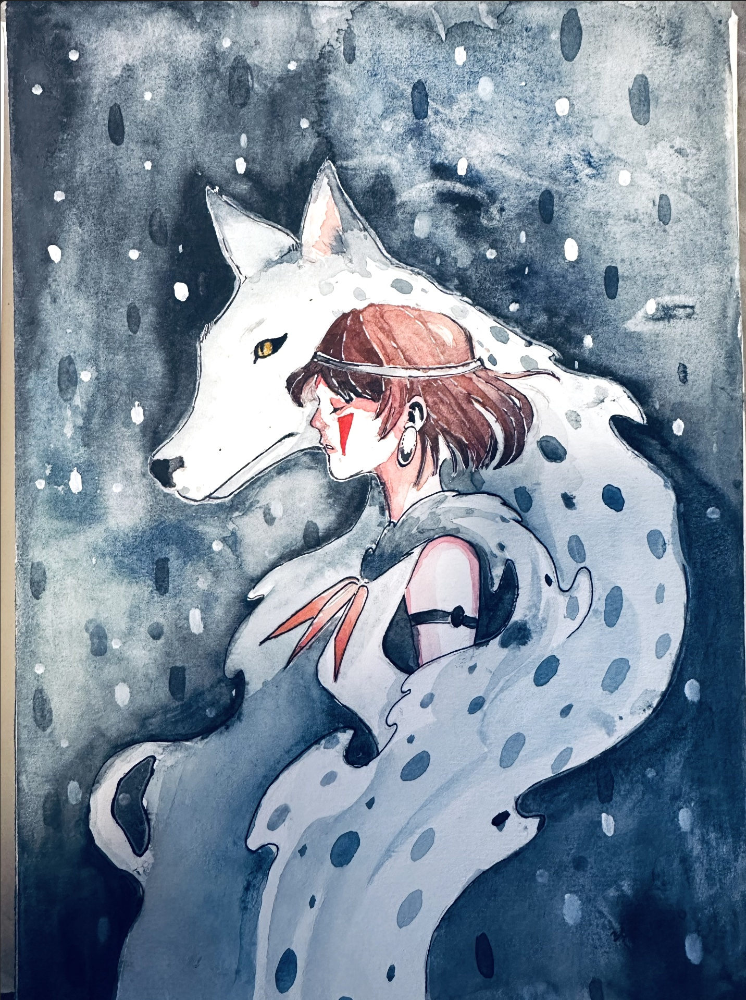
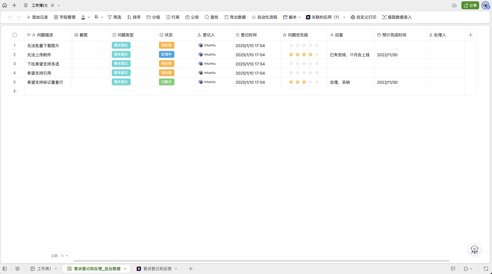

Hello everyone! I'm Xiaoyan Duan, a girl from Shenzhen, in southern China. Currently, I work as a software product manager and have over five years of experience in this dynamic field.Here's a simple story about why I came here



My connection with this industry dates back to my childhood. My parents were fashion designers who ran a store at the Hong Kong port, custom - making suits and gowns for foreigners. They were very busy with work. Besides studying, my favorite activity was to create fashion shows on mannequins using leftover fabric scraps in my parents' clothing factory. Apart from fashion design, I also enjoyed inventing and making handicrafts on my own, as well as drawing. All in all, I like to study problems and bring my ideas to life.

Later, not wanting to waste my college entrance exam results, I opted for a popular major. But my creative urge remained unquenched. I sought a field challenging both my creative and logical faculties, and found it in prouct design – creating better products through rational analysis and innovation. While studying my major, I self-taught design knowledge like the《Five Elements of User Experience》 and 《Design Psychology》, along with software skills such as AI, PS, and Axure. Multiple internships furnished me with design experience and a portfolio, and after graduation, I achieved my goal of becoming a product manager. 

In the six years since, I've overseen numerous products from conception to launch, relishing the fulfillment it brought. I also led research on products with vast user bases, mastering data-driven methodologies.

In 2023, two pivotal events occurred. Reading Hermann Hesse's "Siddhartha" was like a spark that reignited my passion for life, inspiring me to seek broader experiences abroad. So, I decided to study in Europe, drawn by its rich, inclusive culture. Learning additional languages there would expand my horizons further. (Here is the article:[《What Are We Searching For? The Enlightenment from Hermann Hesse's "Siddhartha"》](https://miumiusblog.vercel.app/post/what-are-we-searching-for-the-enlightenment-from-hermann-hesses-siddhartha/ )

Simultaneously, the advent of AI transformed my creative process. Initially, conversing with AI was enlightening; it was like having a brilliant friend. I've tried various AI tools, including using them to create novels, write Processing 5 animation code, train and synthesize voices, generate images and videos, and produce animations. This new era is a double-edged sword: while basic jobs face AI-induced upheaval, those who collaborate with AI can reach new heights of learning and creation. I hope to stand at the forefront of technology, gain a profound understanding of it and apply it effectively. This can help me further unleash my creativity and productivity. With the integration of technological vision, product vision, and aesthetics, I believe I can reach a new level.

For AI work cases, please refer to:[Loop：return to the path](https://youtu.be/VeiZL97zE4A?si=AiXufNaf25D7TT1R),Images, videos and audio productions are completed through Midjourney, Pixverse, Runway and Stable Diffusion. 

