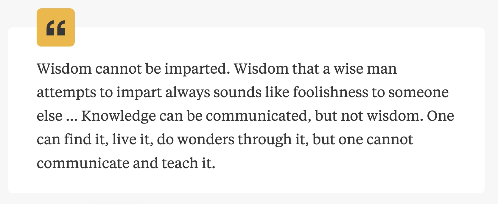

What did Siddhartha realize on his path of seeking the Tao?

Once human beings developed abstract thinking, there emerged a group of people in life who were always in pursuit of meaning and value, constantly asking questions like: As an individual "I", how should I spend my life? In the end, what exactly are the questions that need to be answered in this lifetime? Thanks to some intermittent moments of enlightenment and confusion in my heart recently, I finally read this book that I had been longing to read for a long time. I hoped to consult and discuss with this poet from 60 years ago, and I found quite a lot of resonance.

The book is rather thin and can be finished reading in just one morning, yet it is rich in meaning. Through the comparison of the identities and fates of different characters in the book, I gained a deeper understanding of the theme. The comparison between Siddhartha and Govinda shows two paths of seeking the Tao, one being worldly engagement and the other being withdrawal from the world. The comparison between Siddhartha and Kamala presents the paths of seeking the Tao for a saint who has fallen into the mortal world and a prostitute who yearns for answers. The comparison between Gautama and Vasudeva represents the paths of seeking the Tao through verbal instruction and thinking on the one hand and through personal example and experiencing on the other. The relationship between Siddhartha and his son reflects his transformation from a headstrong son who ran away from home to a pained father who had to accept his son's departure. All these contrasts illustrate that wisdom cannot be taught, and worldly engagement is also of great importance. Everyone must experience their own lonely journey, think as well as experience, love and hate, hesitate, lose, and be tolerant, and then find their own unique wisdom. This is definitely not a Buddhist or Taoist book that advises people to let go; instead, it is precisely a book that gently encourages people to engage with the world and perceive wisdom.

**Siddhartha's life can be divided into several stages:**

***

### I. Setting Out on the Quest: From Selflessness to the Search for the Self

He was originally the son of a Brahmin, wearing a halo of excellence and being a perfect student. Despite his outstanding achievements in spiritual practices, he felt an emptiness within his heart and doubted that the Atman was not to be found there. Thus, he resolutely bid farewell to his father and, together with his friend Govinda who followed him, became an ascetic monk. During his time as an ascetic monk, he practiced self-restraint and meditation, visualizing himself transforming into all things in the world to experience partings in life and death, as well as the processes of decay and disintegration. However, he discovered that although he had managed to break free from the sense of self thousands of times and even lingered in a state of selflessness for whole days, he always had to return to his own self in the end. The experiences as a samana failed to provide him with the answers he sought. So they went to pay their respects to Gautama, the World-Honored One. Gautama's teachings were elaborate and attracted the disciples who came to him, including Govinda. But Siddhartha was an exception. He told the World-Honored One that Gautama's wisdom did not lie in his teachings but in his own experiences, and that he himself needed to undergo those experiences personally.

The concept of Atman originated from ancient Indian philosophy. It pursues the truth of personal spirit and the universe, and holds that through spiritual practices, the two can be integrated harmoniously. Siddhartha failed to find his own Atman through debates, meditation, and contemplation. So he set out. At first, he practiced the method of selflessness but still found himself confused. When he reached middle age, he realized that "I" was his own best teacher. He needed to understand himself, to get to know the mysterious Siddhartha. It was no longer about thinking but about experiencing through the "sensory perception".

> If a person stifles the accidental self in the sense of the senses while nourishing the accidentally learned and capable self in the sense of the mind, he will not be able to find his true self. Both the mind and the senses are beautiful things. Ultimate meanings are hidden behind both of them. Both are worthy of being listened to and participated in. Neither should be despised, nor should they be overestimated.

***

### II. Experiences in the Mortal World: Detachment and Sinking

Siddhartha indulged his physical desires and plunged into the mortal world. He experienced the passion of love with the famous courtesan Kamala and also became a merchant to accumulate wealth. At first, although he was in the secular world, he still remained the Brahmin who was accustomed to spiritual practices and the son of a samana. He used **"fasting, waiting, and thinking"** to understand the secular world. He played around in the mortal world, seeming detached from it all, made friends with many people and handled everything with ease. However, in his heart, he observed the people in the world as if they were children or animals, fluctuating among fame, wealth, desires, and emotions. He both envied and despised them. Eventually, he realized that he was living a ridiculous life. Although he was full of passion and completely absorbed in playing with others, and this game could occasionally bring him pleasure, the real life slipped away from him as his heart was not truly here.

Later, as he was immersed in the secular world, the samana within him died. He continued living and then found that he had become just like other ordinary people, being captured by love, hatred, desires, greed, and laziness. He felt empty and exhausted and left that place. He came to the riverside where the world and the spiritual realm intersected. At the moment when he was thinking of taking his own life, he reunited with his old friend Govinda. At this time, he was an ordinary and vulgar person in the world, while Govinda was a monk who firmly adhered to his spiritual path.

The mortal world has its own wisdom, but it is also a vortex and a trap. Those who don't think will sink into it, while those who think can break through it.

> Intelligence is not the key. There wasn't such a quiet and sheltered corner in his heart. Although others might have it in their hearts, their intelligence was like that of children. Most people, like Kamala, were just like a fallen leaf, rolling and floating in the air, and finally staggering back to the dust. Only a very few people, like stars in the sky, moved along fixed orbits. No wind could shake them as they had their own laws and paths within their hearts.

***

### III. Learning from the River: Endings and Rebirths

Siddhartha felt somewhat absurd. In his pursuit of the true self, he took a "downward path". He transformed from a thinker into an ordinary person in the world. He made himself act stupidly, learned about evil, made mistakes, and experienced disgust, disappointment, and pain. The Siddhartha who was once a samana died in the desires of the mortal world, and the Siddhartha who was immersed in the secular world also died in a state of desolation and exhaustion. Now, a newly reborn Siddhartha emerged! Siddhartha remembered that when he first entered the secular world, he had met a calm old ferryman by the river. He followed this old man and became a new ferryman himself, learning wisdom from the river.

In the river that flowed ceaselessly day after day, he grasped the concepts of "listening without prejudice" and "time does not exist". There was no past, no future; everything was just the essence and the present moment.

Rivers are perhaps endowed with wisdom. Throughout history, both in ancient and modern times, in China and abroad, so many people have attained philosophical insights by the riverside. There are lines like "A thousand sails pass by the wrecked ship", "Water benefits all things without contending", "The rolling waters of the Yangtze River flow eastward", and also Lu Zhishen's realization that "When the tide comes on the Qiantang River today, I finally know who I am". What else did Siddhartha learn from the river? I think it was openness, tolerance, patience, and composure. To listen without preconceptions, to let go of the anxiety and fear about time, to break free from the shackles of yesterday and tomorrow, and to liberate the present self from being defined.

I do have a sense of time pressure. Life is limited. There's the saying "It's better to achieve fame as early as possible", which implies that there are still opportunities for attempts and corrections. However, as people reach middle age or old age, the cost of giving up becomes higher, there is less energy for starting over, and the story of one's life is almost set in stone. Therefore, perhaps the fear of loneliness and the fear of time can be regarded as the two fundamental fears in life. This also explains why people throughout the ages have always been devoted to seeking immortality and the Tao in an attempt to prolong life. Nevertheless, being born in this era, it doesn't seem that there are absolutely no opportunities at all. I'm looking forward to turbulences, changes, and waves, feeling both afraid and excited. I'm still unable to say calmly that "time does not exist", which precisely proves that knowledge can be imparted, but wisdom cannot.

***

### IV. The Cycle of Life, Connection, and Enlightenment

Siddhartha was engaged in meditation by the river, and it seemed as if he had returned to the calm Siddhartha of old. Until he reunited with Kamala and his son, whom he had never known about before. This reunion was both a separation and a new encounter. Siddhartha had a son and a new concern. He wanted to pass on what he had thought and learned to his son. However, his son did not appreciate it, and time did not soften his son's attitude. Siddhartha persisted in his pain until his son ran away from home. His son's reluctance to yield was just like how he, in his youth, had stubbornly stood by his father's bedside. Everyone has their own path.

Siddhartha embarked on the journey of searching for his son. When he was an ordinary person in the world, he both envied and despised the people. He understood and sympathized with the fact that people's lives were governed not by thoughts and reason but by impulses and desires. Now, he envied the intense love between parents and children among the people, feeling sad and yearning. Those desires that he once thought were simple, stupid, and intense were no longer naive, vain, or absurd. He saw life and vitality in them, as well as things that were lovely and worthy of respect. **He realized that the only difference between ordinary people and thinkers was self - awareness, the conscious thinking about life as a whole. And perhaps the value of this self - awareness had been overestimated. Ordinary people were not as shallow as he had thought, and he was not as profound as he had imagined.** He had an epiphany: What exactly is wisdom? It is nothing but the ability to think in a harmonious and unified way at every moment of life, to feel and integrate into this unified soul.

The pain of missing his son and not being able to have his love reciprocated still tormented Siddhartha. However, when Siddhartha stood by the river and looked back on the story of his life, his passion, love, hatred, desires, and martial skills were no longer isolated and specific in the sound of the surging river. Instead, they converged into a unified joy of life. This made Siddhartha's wounds bloom and achieve completeness.

> Indulging in knowledge is like any other kind of hysteria. It provides a way of escape, allowing one to avoid the fear of emptiness, loneliness, frustration, and worthlessness. The radiance of knowledge is a subtle disguise, beneath which lies the darkness that the heart cannot penetrate. The heart fears this unknown, so it escapes into knowledge, theories, hopes, and imagination. And this kind of knowledge is precisely an obstacle to understanding the unknown. - Krishnamurti

***

### V. Perfect Wisdom, Reunion, and Conclusion

Siddhartha returned to the riverside and continued to be the ferryman. One day, he met his friend Govinda again, with whom he had parted ways in their youth. Govinda had been firm in his religious belief throughout his life, following the monastic rules and constantly seeking answers. He had followed Siddhartha to leave the land of the Brahmins and became an ascetic monk. Eventually, influenced by Gautama, the World - Honored One, he converted to Gautama's teachings and left Siddhartha, whom he had originally intended to follow for a lifetime. Now, due to his advanced age, Govinda was respected by the young monks, but his restlessness and pursuit had not ceased.

Siddhartha said to him, **"A seeker often only focuses on the object of his search. He gains nothing and absorbs nothing because he is solely preoccupied with seeking and is dominated by his goal. Seeking means having a target, while discovery means freedom, openness, and being completely without purpose. You may indeed be a seeker, but because you are striving hard to pursue your goal, you miss some things right in front of you."**

Govinda asked Siddhartha for teachings. Siddhartha said, **"Knowledge can be shared, but wisdom cannot. It can only be discovered and experienced." He told Govinda that the opposite of truth may also be true. Everything that can be thought and spoken of is one - sided, partial, lacking in wholeness, perfection, and unity. The contradictions of things coexist in one place. All sins carry forgiveness. The old dwell within all children. The paths of robbers and gamblers may lead to the Buddha, and the path of a Brahmin may lead to a robber. Siddhartha talked about his enlightenment: "I follow the arrangements of my soul and body, experience sins, pursue carnal desires and wealth, be vain, and fall into the most shameful despair, so as to learn to give up struggling and learn to love the world. I no longer compare this world with the perfect world I expected and created, but accept this world, love it, and belong to it." "Perhaps it is precisely words that prevent you from attaining peace. For me, love is the top priority. Examining the world, explaining the world, or despising the world may be the business of thinkers. My only business is to love the world. Do not despise the world, do not hate the world or myself. Look at all things that exist and myself with love, amazement, and awe."**

During the process of imparting the teachings, Siddhartha achieved perfection, wearing a calm, gentle, compassionate, and slightly mocking smile, just like the smile of the Buddha. And Govinda, the monk who had been searching for a lifetime and still had doubts in his heart, recalled all the things he had loved in his life.

***

### The Enlightenment from Siddhartha

Ordinary people's pursuit often begins when they are troubled by worldly desires in the real world and want to seek how to maintain a pure and natural state of mind. The path they choose is to let go and abandon. However, abandoning loss, pain, and anger also means giving up expectations, desires, and happiness. Only in this way can true peace be achieved. Siddhartha's path of seeking the Tao was not like this. He was born seemingly at the destination, yet he found that truth could not be obtained through verbal instruction. So he chose to experience and even "descend" in the opposite way. This journey was all about harvest and experience. Regarding the secular world, he changed from indifference to disgust and finally to love.

My own journey has some similarities with Siddhartha's. Although I'm not at the so-called destination, I started to engage in self-reflection at an early stage. I spent a lot of time focusing on myself and amusing myself, leaving little time for the real world and others. There was a period when I was chatting with my depressed relatives and friends, and I felt complacent about my own self-reflection and self-regulation. However, one day, I suddenly became confused. I stuffed all those unhappy moments into a mental "cabinet" and shut them away in a disorderly manner, just like out of sight, out of mind. I gave up sadness, but also gave up joy. I once pitied them, but now I envy them. Then I realized that what I once thought I didn't need might be a cowardly escape. I began to rethink what I desired, what I needed, and what the questions were that life needed to answer. The first answer I wrote down was "love and being loved". Both love and being loved need to be learned, yet most people act on instinct, unable to build relationships or even hurt each other in intimate relationships. The similarity between me and Siddhartha lies in that this journey forward is not a journey of letting go but a journey of opening up. Opening oneself up, experiencing the world, and taking care of one's own heart can lead to a deeper understanding rather than superficial thinking.

Certainly, self-reflection and understanding are never-ending processes, especially for me at present. Sometimes I gain strength from new understandings, while at other times I encounter setbacks in the real world and then start to question, think, and adjust again. Occasionally, I explore the wisdom of others from highly praised films, TV shows, and books, and I can always find resonance and recognition. I believe that I'm on the right path of thinking. In the past, for a while, I felt pessimistic because I felt that I was drifting away from my "true self". Now, although there are still sad moments, I think it's because I haven't learned "fasting" and "waiting" and haven't dealt well with people's anxiety and lack of confidence in the face of uncertainty. Generally speaking, I'm still happy because I'm getting closer to my "true self". After reading this book, I found many ideas that coincided with my own thoughts, and I'd like to record a few of them here.

**This journey is a lonely one, and we should accept this loneliness.**

After establishing the theme of "love and being loved", my attitude towards a life partner has also changed slightly, from being pessimistic to being embracing. I'm looking forward to having a spiritual companion who can accompany me to read thousands of books and travel thousands of miles. I'm longing for a lasting and profound relationship. However, I think I might be wrong again. Although my expectation is not completely unrealistic, isn't it too luxurious in the real world? Is the pursuit of "longevity" in a relationship correct? In "The Art of Loving", Fromm said that people's fundamental anxiety comes from a sense of loneliness and the fear of coming and going alone in life. So people are always seeking things to resist this loneliness, such as alcohol, drugs, and love. I then began to wonder: Spiritual resonance is one of the things that can help us resist loneliness, but does it have to come from a life partner? Or can it come from friends? Or is writing even more reliable? Longevity in a relationship is so hard to achieve. Compared with the length of time, is the sense of deep participation when we are together the most important? If "love and being loved" is a proposition that I hope to answer, then should I study and accept a broader form of love?

Siddhartha and Kamala had a long-term relationship of love and passion. However, one day, Siddhartha got tired of his vulgar self in the secular world and left without saying goodbye. Kamala didn't say anything. She understood him. Siddhartha once said that it was precisely because Kamala didn't love anyone that she could understand the art of love. Does this mean that when a person attaches too much importance to love, elevates it too highly, and places too many expectations on it, he or she will actually fail to truly understand it? Instead, with a normal and playful heart, one can get a chance to glimpse the mystery. This is the next topic for me to explore. I've always been too serious and haven't mastered the balance between playfulness and sincerity yet. Kamala loved Siddhartha, but she wasn't overly infatuated or dependent. She also had her own pursuits. In the later stage of her life, she donated all her wealth to Gautama and took her child to pay respects to the deceased Gautama. By the river, she was bitten by a poisonous snake. When she met Siddhartha, who was working as a ferryman by the river, in a moment of clarity, she just looked at Siddhartha and said, "Dear, you're old." She calmly let him go without any resentment. When they met again, she said the warm words, "Dear, you're old." I think that's really nice. Marina Abramović has a moving work called "The Artist Is Present". She sat there and had a one-minute eye contact with strangers. It's a very inspiring work. What's more dramatic is the arrival of an unexpected person, who was her former creative partner and lover. They had created many thought-provoking works together and their souls were highly compatible. However, they eventually broke up. Years later, when they reunited, they sat there, looked into each other's eyes, burst into tears, and then held each other's hands.

The journey of life is a lonely one. Siddhartha separated from his father, from Govinda, from Kamala, and from his son, chasing after his own answers. And everyone has to live a lonely life because of the answers they seek. The hope for a lifetime together is too luxurious and is almost doomed to disappointment. Perhaps starting with a playful attitude and participating sincerely can make this lonely journey also a brilliant and lively one.

**What exactly are we looking for in our lifetime? Truth, creation, and love.**

For a long time, I lived in my own mind, in an illusory self in my mind. I talked to my friends about my sense of detachment. And on many nights, I imagined that the bed beneath me would crack open and I would fall into a void, an alien world where no one could find me. But I selfishly hoped that the time flow would be different, that my friends in this world wouldn't be too sad, that they would be a little sad but not too much. Such a state is probably the absurd state of playing in the world that Gautama experienced. He lived a normal life, but he knew that he wasn't truly here. He yearned to participate in and feel the present moment as deeply as other people.

On the path of seeking Atman, Gautama first eliminated the "self" and then sought the "self". He first learned from doctrines and practices, and then from worldly experiences. Finally, he no longer compared this world with the perfect world he expected and created but accepted this world, loved it, and belonged to it. The advantage of our personality is its purity, while the pain mostly comes from thinking too much, doing too little, and being mostly closed in our hearts. I've been seeking how I can become a more complete and whole "self". The final answer is that only by putting myself into a broader range of experiences and emotions can I meet a fuller and more real self, which coincides with the teachings of the book to some extent. However, such thinking sometimes leads me into another kind of irrationality. I regard all these as life experiences, taste my own feelings and changes in this process, think about why I have such feelings, and finally reconcile with these feelings. But this seems to occasionally become a kind of 偏执 and recklessness, falling into another form of being blinded by a single leaf and causing trouble for others. Fortunately, I also have gains. Through daily conversations with myself, I feel that two vivid personalities have formed in my body. One is like a child's personality, responsible for feeling delicately, still with a child's timidity. The other is like an adult's personality, responsible for rationally collecting data about myself. So even when I'm extremely sad, there's still a voice in my mind analyzing why I have such feelings at this moment, what the essence of these feelings is, and whether these feelings are reasonable. Sometimes I even become poetic and can come up with a metaphor for my sad mood at that moment. Maybe I'm sick, or maybe I've got a panacea that can cure everything.

Back to the theme, what exactly are we looking for in our lifetime? At this moment, my answer is "truth, creation, and love". On the path of pursuit, I hope to be brave, sincere, and passionate. Truth refers to the understanding of the world and oneself, which is also the unique, profound, and harmonious understanding that people obtain after their own journeys, as Siddhartha said. Creation emphasizes action, emphasizes traveling thousands of miles, emphasizes the unity of knowledge and action, emphasizes creating value, and emphasizes bringing benefits and meaning to others. Without creation, there is no truth. Love refers to opening up, accepting, experiencing, and perceiving, not being a thinking ascetic monk but being a lively person full of emotions. Feelings, thinking, and actions prompt us to get closer to the truth. Of course, I'm also clear about my own shortcomings and the qualities I cherish. I hope that on this journey of exploration, I can always be brave, never forget to be sincere, and arouse passion. Perhaps there's also anger, but I'm not sure whether it should be included for now. I keep thinking about these qualities while experiencing and feeling, and gradually I no longer cling to the results because I hope to be brave and live in the real world. And what is meant by being brave and real will have different answers for different people in their own explorations.

Finally, how to answer Siddhartha's question? The more you are obsessed with the result of pursuing something and become narrow-minded and focused, the more you will find that the answer is not on this path at the end. Perhaps it's about not being obsessed with definite answers and life itself. You just set up a "bright moon" to pursue and several guiding principles in the lonely wilderness, and the "bright moon" will naturally guide you to move forward.
